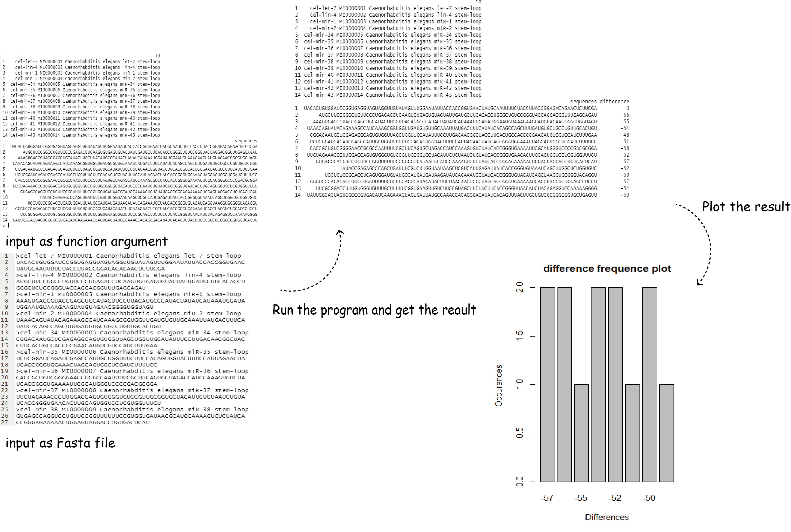
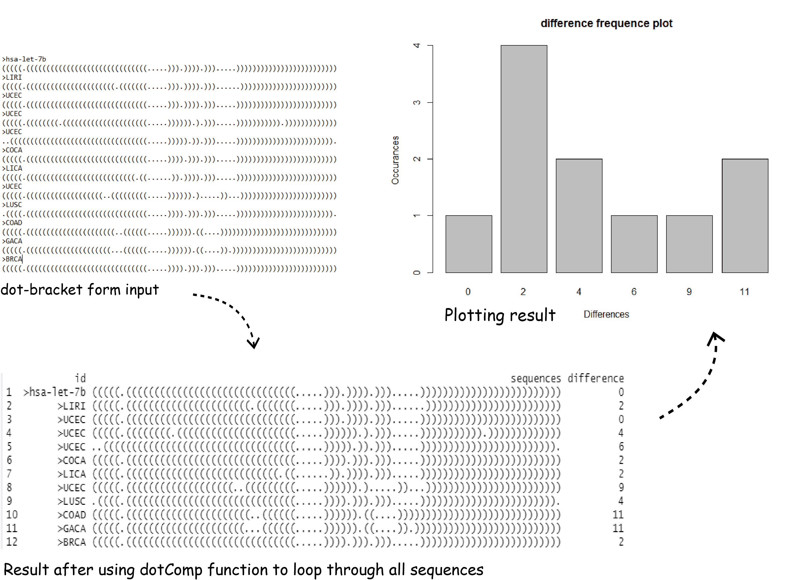
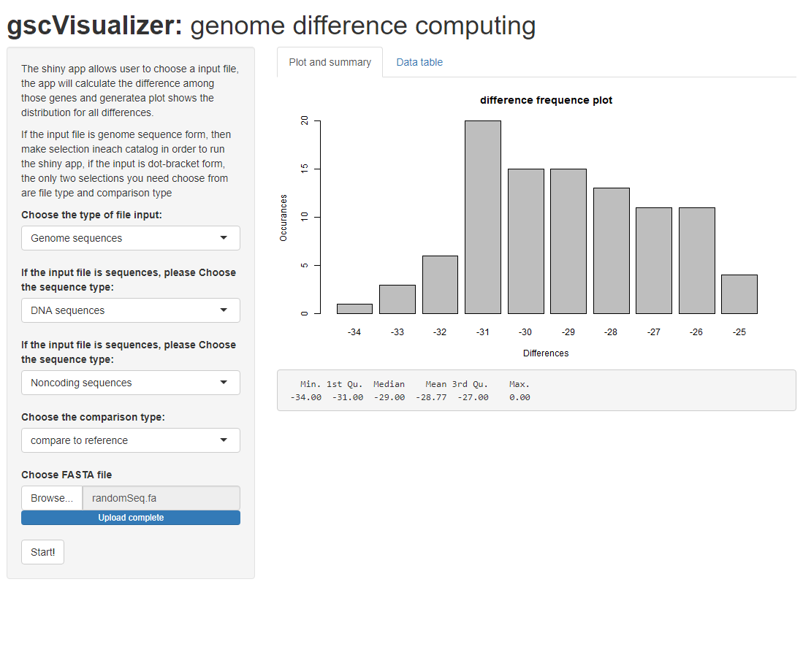

<!-- README.md is generated from README.Rmd. Please edit that file -->

```{r, include = FALSE}
knitr::opts_chunk$set(
  collapse = TRUE,
  comment = "#>",
  fig.path = "man/figures/README-",
  out.width = "100%"
)
```

# gscVisualizer

<!-- badges: start -->
<!-- badges: end -->

## Description

`gscVisualizer` is an R package to comparing the similarity between multiple RNA or DNA sequences.
This tool can use to compare the difference between wild type gene (as an reference) and mutated type
of genes. This package can also be used for computing difference among multiple dot-bracket form RNA sequences. 
A plot can also be generated to make data easier to look at.

## Installation

To install the latest version of the package:

``` r
require("devtools")
devtools::install_github("Deemolotus/gscVisualizer", build_vignettes = TRUE)
library("gscVisualizer")
```

To run the ShinyApp:
```r
gscVisualizer::runGscVisualizer()
```

## Overview

``` r
ls("package:gscVisualizer")
```

`gscVisualizer` contains 7 functions to compute the difference among genes. The __*seqCompareAsInput*__ function will takes in numbers of gene sequences as arguments and compute the difference between each gene sequence with the reference gene. __*seqCompareInPair*__ function will takes in number if gene sequences as argument and calculate the difference between each pair of genes. __*seqCompareAsFile*__ function will takes in a .fa file and convert the .fa file to dataframes, then do the difference comparison between every gene sequence with the reference sequence. __*seqCompareAsFilePair*__ function do the similar thing as __*seqCompareInpair*__ but get all data from .fa file instead of input arguments. __*dotComp*__ function will takes in two dot-bracket sequence and then compute the difference between two RNA structure. __*checkSeq*__ function will takes in one sequence and make sure the dot-bracket seequence is valid.

An overview of the package is illustrated below:
<div style="text-align:center">
<div style="text-align:left">

<div style="text-align:center">
<div style="text-align:left">

Alternatively, the Shiny app can also be used for generating the final result
```r
gscVisualizer::runGscVisualizer()
```
<div style="text-align:center">
<div style="text-align:left">

The package tree structure is provide below

```r
- gscVisualizer
  |- gscVisualizer.Rproj
  |- DESCRIPTION
  |- NAMESPACE
  |- LICENSE
  |- README
  |- data
    |- dotCompExample.rda
    |- ExampleSequence.rda
  |- inst
    |- extdata
      |- randomSeq.fa
      |- seqCompareAsFileTest.fa
      |- seqCompareAsInputExample.rds
      |- test.fa
      |- shiny.png
      |- workflow.png
      |- workflow1.png
    |- shiny-scripts
      |- app.R
    |-CITATION
  |- man
    |- checkSeq.Rd
    |- dotComp.Rd
    |- dotCompExample.Rd
    |- ExampleSequence.Rd
    |- plotter.Rd
    |- runGscVisualizer.Rd
    |- seqCompareAsFile.Rd
    |- seqCompareAsFilePair.Rd
    |- seqCompareAsInput.Rd
    |- seqCompareInPair.Rd
  |- R
    |- data.R
    |- dotComp.R
    |- plotter.R
    |- runGscVisualizer.R
    |- seqCompareAsInput.R
  |- vignettes
    |- Introduction_gscVisualizer.Rmd
    |- Introduction_gscVisualizer.md
    |- shinyAppGscVisualizer.Rmd
    |- shinyAppGscVisualizer.md
    |- dotComp.png
    |- dotCompResult.png
    |- guide1.png
    |- guide2.png
    |- guide3.png
    |- guide4.png
    |- guide5.png
    |- Rplot.png
    |- seqCompareAsFile.png
    |- seqCompareAsFilePair.png
  |- tests
    |- testthat.R
    |- testthat
      |- Rplots.pdf
      |- test-checkSeq.R
      |- test-dotComp.R
      |- test-plotter.R
      |- test-seqcompareAsFile.R
      |- test-seqcompareAsFilePair.R
      |- test-seqCompareInPair.R
      |- test-test-seqCompareAsInput.R
```

## Tutorials  
  
For tutorials and plot interpretation, refer to the vignette:

``` r
browseVignettes("gscVisualizer")
```
gscVisualizer introduction: https://github.com/Deemolotus/gscVisualizer/tree/master/vignettes/Introduction_gscVisualizer.md

instruction for the shiny app: https://github.com/Deemolotus/gscVisualizer/tree/master/vignettes/shinyAppGscVisualizer.md

## Citation for Package
```r
citation("gscVisualizer")
```
Tan, Z. (2020) gscVisualizer (Gene sequence comparison visualizer): an R package for comparing the difference in gene sequences, then visualize the result by plotting. URL https://github.com/Deemolotus/gscVisualizer

## Contributions

The author of this package is Zhiwen Tan. All of __*seqCompareAsInput*__, __*seqCompareInPair*__, __*seqCompareAsFile*__ and __*seqCompareAsFilePair*__ functions makes use of s2c and translate functions from __*seqinr*__ R package to convert the DNA or RNA sequences to amino acid. Those two functions also makes use of needles function from __*NameNeedle*__ R package to calculate the difference between different gene sequences. The __*NameNeedle*__ R package is also been used in __*dotComp*__ function. The __*seqCompareAsFile*__ and __*seqCompareAsFilePair*__ function also makes use of readRNAStringSet function from __*Biostrings*__ to extract information from .fa file to make a list of dataframes. The __*plotter*__ function makes use of the __*graphic*__ R package.

## References
  
Charif D, Lobry J (2007). “SeqinR 1.0-2: a contributed package to the R project for statistical
computing devoted to biological sequences retrieval and analysis.” In Bastolla U, Porto M, Roman H,
Vendruscolo M (eds.), Structural approaches to sequence evolution: Molecules, networks, populations,
series Biological and Medical Physics, Biomedical Engineering, 207-232.
Springer Verlag, New York. ISBN : 978-3-540-35305-8. http://seqinr.r-forge.r-project.org/

Kevin R. Coombes (2020). NameNeedle: Using Needleman-Wunsch to Match Sample Names. R package version
1.2.6/r51. https://R-Forge.R-project.org/projects/nameneedle/

Pagès H, Aboyoun P, Gentleman R, DebRoy S (2020). Biostrings: Efficient manipulation of biological strings.
R package version 2.58.0, https://bioconductor.org/packages/Biostrings 
  
Wickham, H. and Bryan, J. (2019). *R Packages* (2nd edition). Newton, Massachusetts: O'Reilly Media. https://r-pkgs.org/  

Kozomara, A., & Griffiths-Jones, S. (2011). miRBase: integrating microRNA annotation and deep-sequencing data. Nucleic acids research, 39(Database issue), D152–D157. https://doi.org/10.1093/nar/gkq1027

Steipe B., ABC project (.utility 4.07) A Bioinformatics Course: Applied Bioinformatics http://steipe.biochemistry.utoronto.ca/abc/index.php/Bioinformatics_Main_Page

Zhiwen. T, Sijie Xu (2020) miRNA Motif Analysis https://github.com/Deemolotus/BCB330Y-and-BCB430Y/tree/master/Main
  
## Acknowledgements

This package was developed for BCB410H: Applied Bioinformatics, University of Toronto, Toronto, CANADA. 
  
  
  
  
  
  
  
  
  
