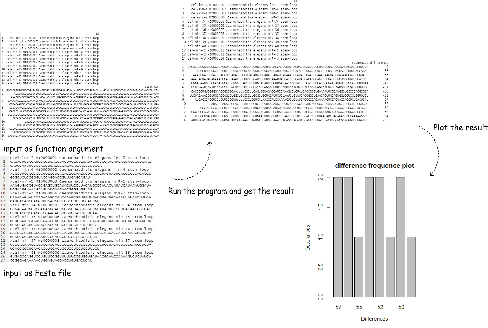

<!-- README.md is generated from README.Rmd. Please edit that file -->

# gscVisualizer

<!-- badges: start -->

<!-- badges: end -->

## Description

`gscVisualizer` is an R package to comparing the similarity between
multiple RNA or DNA sequences. This tool can use to compare the
difference between wild type gene (as an reference) and mutated type of
genes. A plot can also be generated to make data easier to look at.

## Installation

To install the latest version of the package:

``` r
require("devtools")
devtools::install_github("Deemolotus/gscVisualizer", build_vignettes = TRUE)
library("gscVisualizer")
```

## Overview

``` r
ls("package:gscVisualizer")
```

`gscVisualizer` contains 5 functions to compute the difference among
genes. The ***seqCompareAsInput*** function will takes in numbers of
gene sequences as arguments and compute the difference between each gene
sequence with the reference gene. ***seqCompareInPair*** function will
takes in number if gene sequences as argument and calculate the
difference between each pair of genes. ***seqCompareAsFile*** function
will takes in a .fa file and convert the .fa file to dataframes, then do
the difference comparison between every gene sequence with the reference
sequence. ***seqCompareAsFilePair*** function do the similar thing as
***seqCompareInpair*** but get all data from .fa file instead of input
arguments.

``` r
browseVignettes("gscVisualizer")
```

An overview of the package is illustrated below:

<div style="text-align:center">



<div style="text-align:left">

The package tree structure is provide below

``` r
- gscVisualizer
  |- gscVisualizer.Rproj
  |- DESCRIPTION
  |- NAMESPACE
  |- LICENSE
  |- README
  |- data
    |- ExampleSequence.rda
  |- inst
    |- extdata
      |- seqCompareAsFileTest.fa
      |- test.fa
  |- man
    |- ExampleSequence.Rd
    |- plotter.Rd
    |- seqCompareAsFile.Rd
    |- seqCompareAsFilePair.Rd
    |- seqCompareAsInput.Rd
    |- seqCompareInPair.Rd
  |- R
    |- plotter.R
    |- seqCompareAsInput.R
  |- vignettes
    |- Introduction_gscVisualizer.Rmd
  |- tests
    |- testthat.R
    |- testthat
      |- Rplots.pdf
      |- test-plotter.R
      |- test-seqcompareAsFile.R
      |- test-seqcompareAsFilePair.R
      |- test-seqCompareInPair.R
      |- test-test-seqCompareAsInput.R
```

## Contributions

The author of this package is Zhiwen Tan. All of
***seqCompareAsInput***, ***seqCompareInPair***, ***seqCompareAsFile***
and ***seqCompareAsFilePair*** functions makes use of s2c and translate
functions from ***seqinr*** R package to convert the DNA or RNA
sequences to amino acid. Those two functions also makes use of needles
function from ***NameNeedle*** R package to calculate the difference
between different gene sequences. The ***seqCompareAsFile*** and
***seqCompareAsFilePair*** function also makes use of readRNAStringSet
function from ***Biostrings*** to extract information from .fa file to
make a list of dataframes. The ***plotter*** function makes use of the
***graphic*** R package.

## References

Charif D, Lobry J (2007). “SeqinR 1.0-2: a contributed package to the R
project for statistical computing devoted to biological sequences
retrieval and analysis.” In Bastolla U, Porto M, Roman H, Vendruscolo M
(eds.), Structural approaches to sequence evolution: Molecules,
networks, populations, series Biological and Medical Physics, Biomedical
Engineering, 207-232. Springer Verlag, New York. ISBN :
978-3-540-35305-8. <http://seqinr.r-forge.r-project.org/>

Kevin R. Coombes (2020). NameNeedle: Using Needleman-Wunsch to Match
Sample Names. R package version 1.2.6/r51.
<https://R-Forge.R-project.org/projects/nameneedle/>

Pagès H, Aboyoun P, Gentleman R, DebRoy S (2020). Biostrings: Efficient
manipulation of biological strings. R package version 2.58.0,
<https://bioconductor.org/packages/Biostrings>

Wickham, H. and Bryan, J. (2019). *R Packages* (2nd edition). Newton,
Massachusetts: O’Reilly Media. <https://r-pkgs.org/>

Kozomara, A., & Griffiths-Jones, S. (2011). miRBase: integrating
microRNA annotation and deep-sequencing data. Nucleic acids research,
39(Database issue), D152–D157. <https://doi.org/10.1093/nar/gkq1027>

## Acknowledgements

This package was developed for BCB410H: Applied Bioinformatics,
University of Toronto, Toronto, CANADA.
