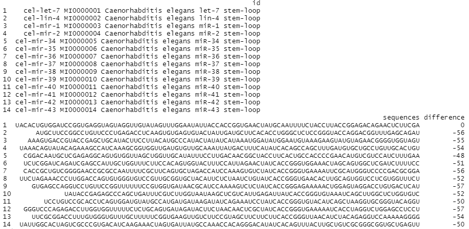
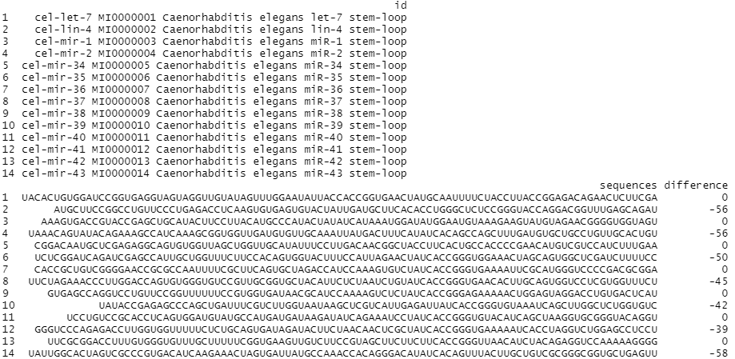

## Introduction
`gscVisualizer` is an R package to comparing the similarity between
multiple RNA or DNA sequences. This tool can use to compare the
difference between wild type gene (as an reference) and mutated type of
genes. A plot can also be generated to make data easier to look at. This document gives a tour of gscVisualizer package.

see `help(package = "gscVisualizer")` for more information and references provided by `citation("gscVisualizer")`

To download **gscVisualizer**, use the following commands:

```r
require("devtools")
devtools::install_github("Deemolotus/gscVisualizer", build_vignettes = TRUE)
library("gscVisualizer")
```

To list all functions available in this package:

```r
ls("package:gscVisualizer")
```

To list sample dataset in this package:

``` r
data(package = "gscVisualizer")
```

<br>

## Components
There are 7 functions in this package, the __*seqCompareAsInput*__ allows user to input sequences information as argument of this function, Then make comparison among those genes. See `?seqCompareAsInput` for more informations. The __*seqCompareInPair*__. function allow user to input sequences information as argument. This function will make comparison between each pair of gene sequences. See `?seqCompareAsInput` for more informations. The function __*seqCompareAsFile*__. and __*seqCompareAsFilePair*__. allows use to input a .fa file and doing sequence comparison. The function __*dotComp*__ allows user to input two dot-bracket form sequences and the fuction will return the difference between those two sequences. The function __*checkSeq*__ allows user to input a dot-bracket sequence and this function will validate the dot-bracket sequence. The __*plotter*__ function will convert the result into barplot form. The tree structure was shown on readme.md. Below is an illustrate how to use those function together.

here is an example shows the different between __*seqCompareAsInput*__. and  __*seqCompareInPair*__., in __*seqCompareAsInput*__., every sequecence is compare with the first "accg" sequence, in __*seqCompareInPair*__., every pair of sequence are being compared, "sequence 1 compare to sequence 2, sequence 3 compare to sequence 4. This different is also present between __*seqCompareAsFile*__. and __*seqCompareAsFilePair*__.

```r
> seqCompareAsInput("1", "accg", "noncoding", "2", "accc", "3", "acca", "4", "acct")
  id sequences difference
1  1      accg          0
2  2      accc         -1
3  3      acca         -1
4  4      acct         -1

> seqCompareInPair("noncoding", "1", "accg", "2", "accc", "3", "acca", "4", "acct")
  id sequences difference
1  1      accg          0
2  2      accc         -1
3  3      acca          0
4  4      acct         -1
```

choose from all four functions except plotter to get result in a list form
```r
filePath <- system.file("extdata", "test.fa", package = "gscVisualizer")
seqInfo <- seqCompareAsFile("RNA", "noncoding", filePath)
# get all data from the list
seqInfo
```
<div style="text-align:center">
<div style="text-align:left">

The user has the option to produce a list of numbers or a plot. Use plotter function to make a bar plot.
```r
plotter(seqInfo)
```

<div style="text-align:center">
<div style="text-align:left">

For __*seqCompareInPair*__ and __*seqCompareAsFilePair*__. functions, the result will be given in pairs. But this suggest every pairs are different type of data, so there is no specific ploting function for those two functions.

```r
filePath <- system.file("extdata", "test.fa", package = "gscVisualizer")
seqInfo <- seqCompareAsFilePair("RNA", "noncoding", filePath)
seqInfo
```
<div style="text-align:center">
<div style="text-align:left">

Besides __*seqCompareAsFilePair*__. and __*seqCompareAsFile*__. functions, __*seqCompareAsInput*__ and __*seqCompareInPair*__. functions are used for a smaller dataset, this can reduce the time on combining different file to one file. 

The function __*dotComp*__ will automatically call __*checkSeq*__ function while running, so there is no need to call __*checkSeq*__ while __*dotComp*__ is running, but if the work is only about validate dot-bracket sequences, __*checkSeq*__ function can be use directly. The __*dotComp*__ function has an optional argument, if the option argument is missing, then the function will make comparison all characters of the sequence, if option is set to 1, then function will use sequence alignment method to compute the difference.
```r
> dotComp("...(((...)))...", ".(.(.(...)))...")
[1] 2
> dotComp("...(((...)))...", ".(.(.(...)))...", option = 1)
[1] 2
> checkSeq("...(((...)))...")
[1] ""
> checkSeq("...(((...)))..).")
[1] "error"
```

The following example illustrate how to use __*dotComp*__ function when comparing multiple sequences
```r
example <- get(load("./data/dotCompExample.rda"))
example[["difference"]] <- 0

for (i in seq_along(example$sequences)) {
  dif <- dotComp(example$sequences[1], example$sequences[i], option = 1)
  example$difference[i] <- dif
}

example
```
<div style="text-align:center">
<div style="text-align:left">

The result can also be visualize by __*plotter*__ function
```r
plotter(example)
```
<div style="text-align:center">
<div style="text-align:left">

## Package References

[Tan, Z. (2020) gscVisualizer (Gene sequence comparison visualizer): an R package for comparing the difference in gene sequences, then visualize the result by plotting.
](https://github.com/Deemolotus/gscVisualizer)

<br>

## Other References

Charif D, Lobry J (2007). “SeqinR 1.0-2: a contributed package to the R
project for statistical computing devoted to biological sequences
retrieval and analysis.” In Bastolla U, Porto M, Roman H, Vendruscolo M
(eds.), Structural approaches to sequence evolution: Molecules,
networks, populations, series Biological and Medical Physics, Biomedical
Engineering, 207-232. Springer Verlag, New York. ISBN :
978-3-540-35305-8. <http://seqinr.r-forge.r-project.org/>

Kevin R. Coombes (2020). NameNeedle: Using Needleman-Wunsch to Match
Sample Names. R package version 1.2.6/r51.
<https://R-Forge.R-project.org/projects/nameneedle/>

Pagès H, Aboyoun P, Gentleman R, DebRoy S (2020). Biostrings: Efficient
manipulation of biological strings. R package version 2.58.0,
<https://bioconductor.org/packages/Biostrings>

Wickham, H. and Bryan, J. (2019). *R Packages* (2nd edition). Newton,
Massachusetts: O’Reilly Media. <https://r-pkgs.org/>

Kozomara, A., & Griffiths-Jones, S. (2011). miRBase: integrating
microRNA annotation and deep-sequencing data. Nucleic acids research,
39(Database issue), D152–D157. <https://doi.org/10.1093/nar/gkq1027>

Steipe B., ABC project (.utility 4.07) A Bioinformatics Course: Applied Bioinformatics http://steipe.biochemistry.utoronto.ca/abc/index.php/Bioinformatics_Main_Page

Zhiwen. T, Sijie Xu (2020) miRNA Motif Analysis https://github.com/Deemolotus/BCB330Y-and-BCB430Y/tree/master/Main

----


```r
sessionInfo()
#> R version 4.0.2 (2020-06-22)
#> Platform: x86_64-w64-mingw32/x64 (64-bit)
#> Running under: Windows 10 x64 (build 19042)
#> 
#> Matrix products: default
#> 
#> locale:
#> [1] LC_COLLATE=Chinese (Simplified)_China.936  LC_CTYPE=Chinese (Simplified)_China.936    LC_MONETARY=Chinese (Simplified)_China.936
#> [4] LC_NUMERIC=C                               LC_TIME=Chinese (Simplified)_China.936    
#> 
#> attached base packages:
#> [1] stats     graphics  grDevices utils     datasets  methods   base     
#> 
#> other attached packages:
#> [1] shiny_1.5.0
#> 
#> loaded via a namespace (and not attached):
#>  [1] xfun_0.18           remotes_2.2.0       vctrs_0.3.4         testthat_2.3.2      usethis_1.6.3       htmltools_0.5.0    
#>  [7] stats4_4.0.2        yaml_2.2.1          rlang_0.4.8         pkgbuild_1.1.0      later_1.1.0.1       pillar_1.4.6       
#> [13] glue_1.4.2          withr_2.3.0         BiocGenerics_0.34.0 sessioninfo_1.1.1   lifecycle_0.2.0     stringr_1.4.0      
#> [19] zlibbioc_1.34.0     Biostrings_2.56.0   devtools_2.3.2      memoise_1.1.0       evaluate_0.14       knitr_1.30         
#> [25] callr_3.5.1         IRanges_2.22.2      fastmap_1.0.1       httpuv_1.5.4        ps_1.4.0            curl_4.3           
#> [31] parallel_4.0.2      fansi_0.4.1         Rcpp_1.0.5          xtable_1.8-4        backports_1.1.10    promises_1.1.1     
#> [37] S4Vectors_0.26.1    desc_1.2.0          pkgload_1.1.0       jsonlite_1.7.1.9000 XVector_0.28.0      mime_0.9           
#> [43] fs_1.5.0            digest_0.6.25       stringi_1.5.3       processx_3.4.4      ade4_1.7-2          rprojroot_1.3-2    
#> [49] cli_2.1.0           tools_4.0.2         NameNeedle_1.2.6    magrittr_1.5        tibble_3.0.4        whisker_0.4        
#> [55] crayon_1.3.4        seqinr_4.2-4        pkgconfig_2.0.3     ellipsis_0.3.1      prettyunits_1.1.1   assertthat_0.2.1   
#> [61] rmarkdown_2.4       httr_1.4.2          rstudioapi_0.11     R6_2.4.1            git2r_0.27.1        compiler_4.0.2
```
