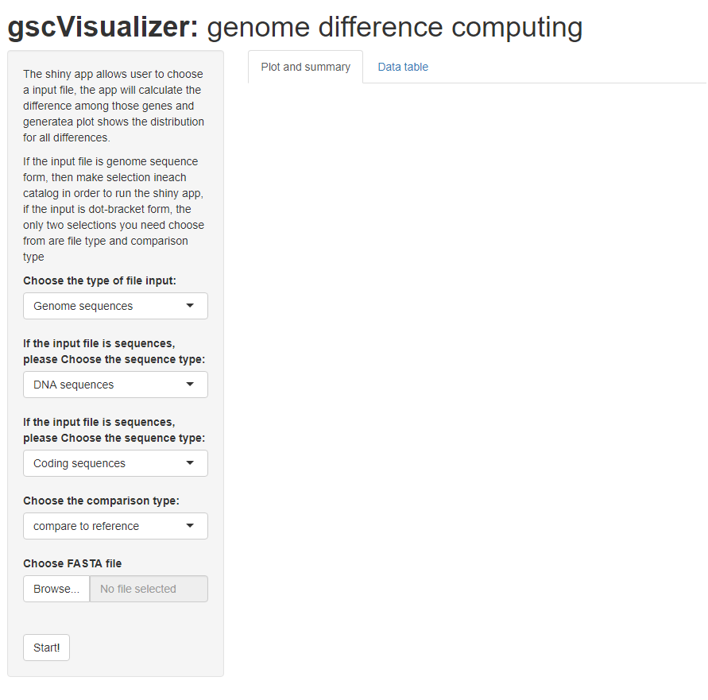
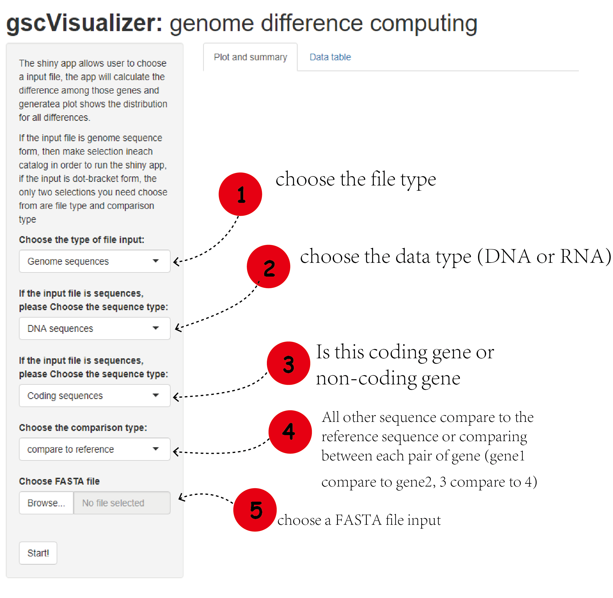
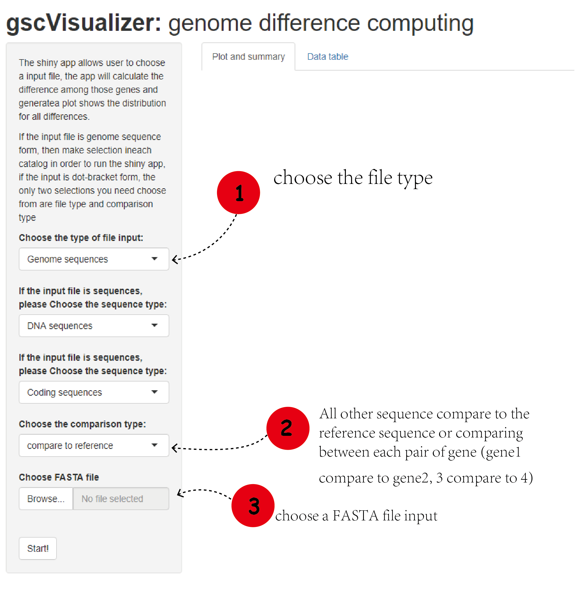
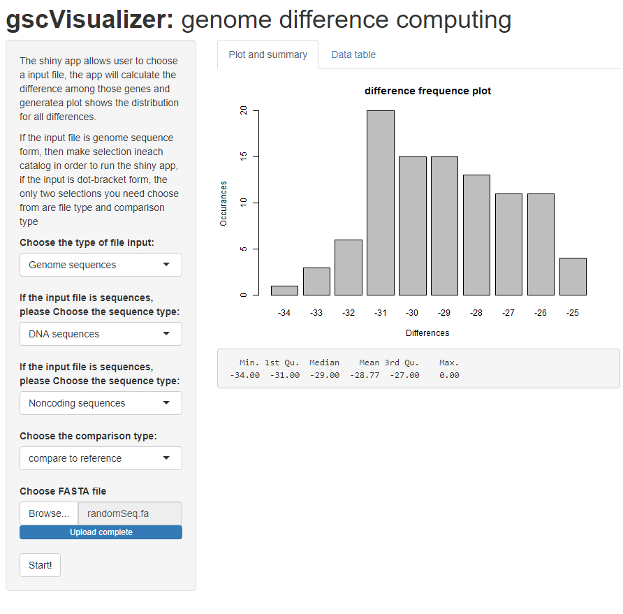
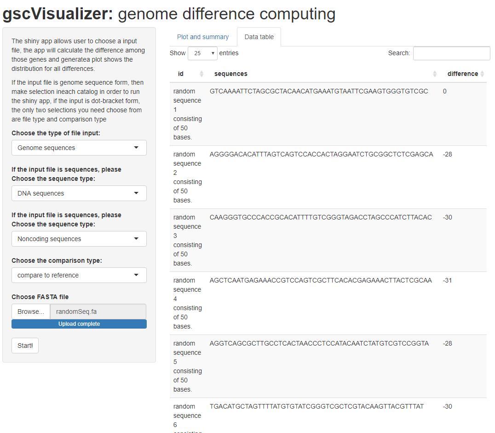

```{r, include = FALSE}
knitr::opts_chunk$set(
  collapse = TRUE,
  comment = "#>"
)
```

## Run Shiny App
To run the shiny app, use the code below
```r
gscVisualizer::runGscVisualizer()
```

## Use The Shiny App
After open the shiny app, a screen will popup like this
<div style="text-align:center">
<div style="text-align:left">

If the input is a file of genome sequences, follow the instruction below
<div style="text-align:center">
<div style="text-align:left">

If the input is a file of dot-bracket sequences, follow the instruction below
<div style="text-align:center">
<div style="text-align:left">

## Example
There is a file called randomSeq.fa file in ./inst/extdata folder. Inside the file, there are 50 randomly generated DNA sequences. In this example, let assume the sequences in this file are non-coding sequences, and every sequences are compared with the first sequence in the file. Then click the start button. The result should looks like below.
<div style="text-align:center">
<div style="text-align:left">
The data table tab look like this
<div style="text-align:center">
<div style="text-align:left">

## Package References

[Tan, Z. (2020) gscVisualizer (Gene sequence comparison visualizer): an R package for comparing the difference in gene sequences, then visualize the result by plotting.
](https://github.com/Deemolotus/gscVisualizer)

<br>

## Other References

Charif D, Lobry J (2007). “SeqinR 1.0-2: a contributed package to the R
project for statistical computing devoted to biological sequences
retrieval and analysis.” In Bastolla U, Porto M, Roman H, Vendruscolo M
(eds.), Structural approaches to sequence evolution: Molecules,
networks, populations, series Biological and Medical Physics, Biomedical
Engineering, 207-232. Springer Verlag, New York. ISBN :
978-3-540-35305-8. <http://seqinr.r-forge.r-project.org/>

Kevin R. Coombes (2020). NameNeedle: Using Needleman-Wunsch to Match
Sample Names. R package version 1.2.6/r51.
<https://R-Forge.R-project.org/projects/nameneedle/>

Pagès H, Aboyoun P, Gentleman R, DebRoy S (2020). Biostrings: Efficient
manipulation of biological strings. R package version 2.58.0,
<https://bioconductor.org/packages/Biostrings>

Wickham, H. and Bryan, J. (2019). *R Packages* (2nd edition). Newton,
Massachusetts: O’Reilly Media. <https://r-pkgs.org/>

Kozomara, A., & Griffiths-Jones, S. (2011). miRBase: integrating
microRNA annotation and deep-sequencing data. Nucleic acids research,
39(Database issue), D152–D157. <https://doi.org/10.1093/nar/gkq1027>

Steipe B., ABC project (.utility 4.07) A Bioinformatics Course: Applied Bioinformatics http://steipe.biochemistry.utoronto.ca/abc/index.php/Bioinformatics_Main_Page

Zhiwen. T, Sijie Xu (2020) miRNA Motif Analysis https://github.com/Deemolotus/BCB330Y-and-BCB430Y/tree/master/Main

----

```{r}
sessionInfo()
```
