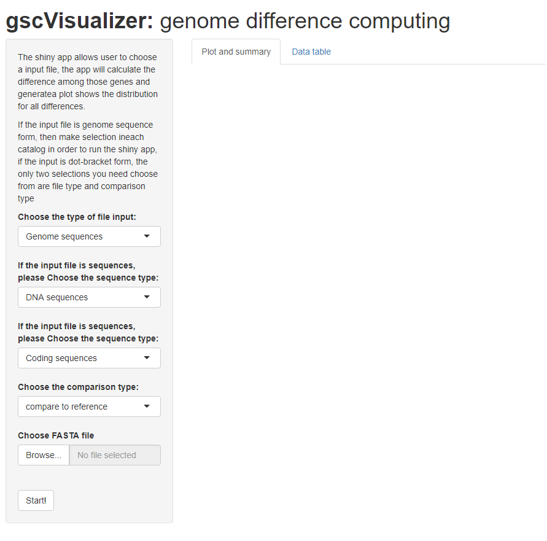
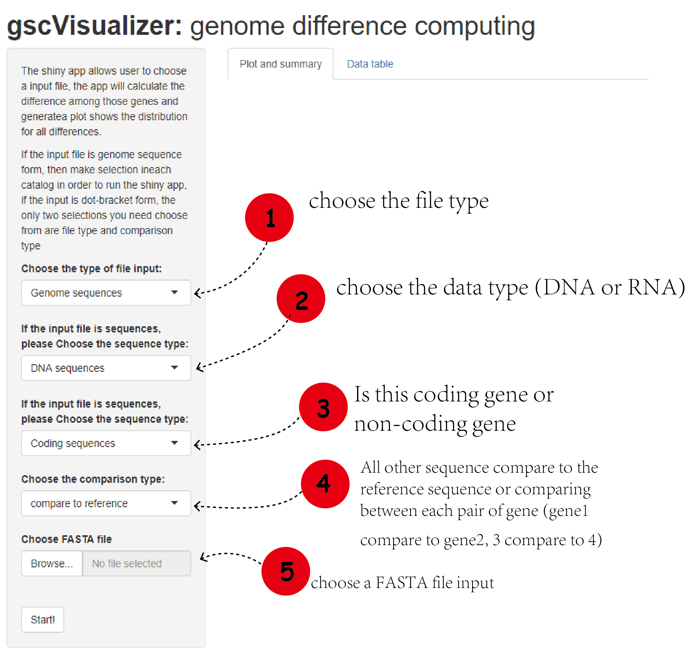
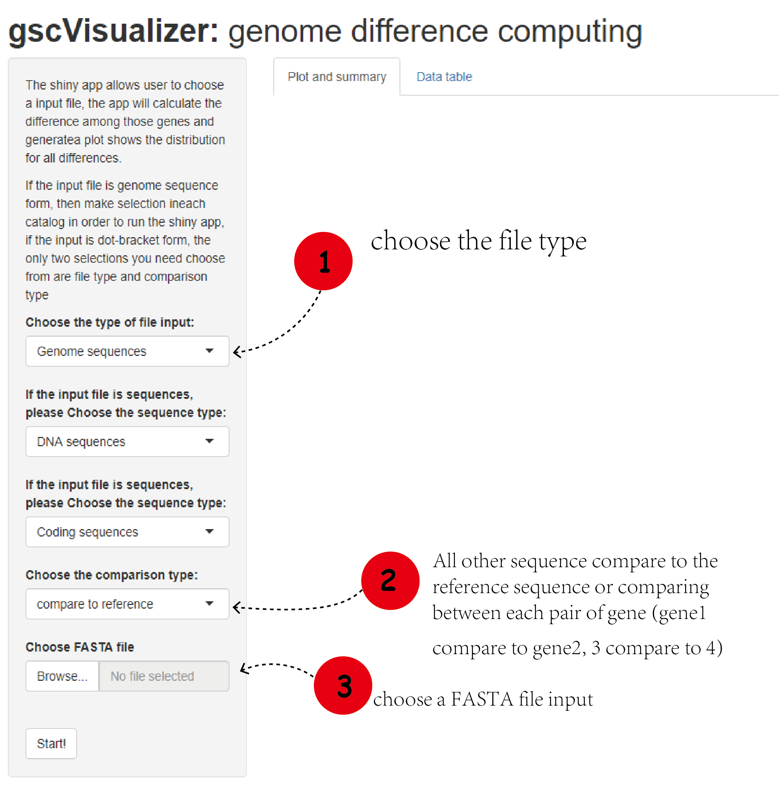

## Run Shiny App
To run the shiny app, use the code below
```r
gscVisualizer::runGscVisualizer()
```

## Use The Shiny App
After open the shiny app, a screen will popup like this
<div style="text-align:center">
<div style="text-align:left">

If the input is a file of genome sequences, follow the instruction below
<div style="text-align:center">
<div style="text-align:left">

If the input is a file of dot-bracket sequences, follow the instruction below
<div style="text-align:center">
<div style="text-align:left">

## Example
There is a file called randomSeq.fa file in ./inst/extdata folder. Inside the file, there are 50 randomly generated DNA sequences. In this example, let assume the sequences in this file are non-coding sequences, and every sequences are compared with the first sequence in the file. Then click the start button. The result should looks like below.
<div style="text-align:center">
<div style="text-align:left">
The data table tab look like this
<div style="text-align:center">
<div style="text-align:left">

## Package References

[Tan, Z. (2020) gscVisualizer (Gene sequence comparison visualizer): an R package for comparing the difference in gene sequences, then visualize the result by plotting.
](https://github.com/Deemolotus/gscVisualizer)

<br>

## Other References

Charif D, Lobry J (2007). “SeqinR 1.0-2: a contributed package to the R
project for statistical computing devoted to biological sequences
retrieval and analysis.” In Bastolla U, Porto M, Roman H, Vendruscolo M
(eds.), Structural approaches to sequence evolution: Molecules,
networks, populations, series Biological and Medical Physics, Biomedical
Engineering, 207-232. Springer Verlag, New York. ISBN :
978-3-540-35305-8. <http://seqinr.r-forge.r-project.org/>

Kevin R. Coombes (2020). NameNeedle: Using Needleman-Wunsch to Match
Sample Names. R package version 1.2.6/r51.
<https://R-Forge.R-project.org/projects/nameneedle/>

Pagès H, Aboyoun P, Gentleman R, DebRoy S (2020). Biostrings: Efficient
manipulation of biological strings. R package version 2.58.0,
<https://bioconductor.org/packages/Biostrings>

Wickham, H. and Bryan, J. (2019). *R Packages* (2nd edition). Newton,
Massachusetts: O’Reilly Media. <https://r-pkgs.org/>

Kozomara, A., & Griffiths-Jones, S. (2011). miRBase: integrating
microRNA annotation and deep-sequencing data. Nucleic acids research,
39(Database issue), D152–D157. <https://doi.org/10.1093/nar/gkq1027>

Steipe B., ABC project (.utility 4.07) A Bioinformatics Course: Applied Bioinformatics http://steipe.biochemistry.utoronto.ca/abc/index.php/Bioinformatics_Main_Page

Zhiwen. T, Sijie Xu (2020) miRNA Motif Analysis https://github.com/Deemolotus/BCB330Y-and-BCB430Y/tree/master/Main

----


```r
sessionInfo()
#> R version 4.0.2 (2020-06-22)
#> Platform: x86_64-w64-mingw32/x64 (64-bit)
#> Running under: Windows 10 x64 (build 19042)
#> 
#> Matrix products: default
#> 
#> locale:
#> [1] LC_COLLATE=Chinese (Simplified)_China.936  LC_CTYPE=Chinese (Simplified)_China.936    LC_MONETARY=Chinese (Simplified)_China.936
#> [4] LC_NUMERIC=C                               LC_TIME=Chinese (Simplified)_China.936    
#> 
#> attached base packages:
#> [1] stats     graphics  grDevices utils     datasets  methods   base     
#> 
#> other attached packages:
#> [1] gscVisualizer_0.1.0 shiny_1.5.0         testthat_2.3.2     
#> 
#> loaded via a namespace (and not attached):
#>  [1] Rcpp_1.0.5          prettyunits_1.1.1   ps_1.4.0            Biostrings_2.56.0   assertthat_0.2.1    rprojroot_1.3-2    
#>  [7] digest_0.6.25       mime_0.9            R6_2.4.1            backports_1.1.10    stats4_4.0.2        evaluate_0.14      
#> [13] pillar_1.4.6        zlibbioc_1.34.0     rlang_0.4.8         curl_4.3            rstudioapi_0.11     whisker_0.4        
#> [19] callr_3.5.1         S4Vectors_0.26.1    rmarkdown_2.4       desc_1.2.0          devtools_2.3.2      stringr_1.4.0      
#> [25] compiler_4.0.2      httpuv_1.5.4        xfun_0.18           pkgconfig_2.0.3     BiocGenerics_0.34.0 pkgbuild_1.1.0     
#> [31] NameNeedle_1.2.6    htmltools_0.5.0     tibble_3.0.4        roxygen2_7.1.1      IRanges_2.22.2      fansi_0.4.1        
#> [37] crayon_1.3.4        withr_2.3.0         later_1.1.0.1       commonmark_1.7      jsonlite_1.7.1.9000 xtable_1.8-4       
#> [43] lifecycle_0.2.0     git2r_0.27.1        magrittr_1.5        cli_2.1.0           stringi_1.5.3       XVector_0.28.0     
#> [49] fs_1.5.0            promises_1.1.1      remotes_2.2.0       xml2_1.3.2          seqinr_4.2-4        ellipsis_0.3.1     
#> [55] vctrs_0.3.4         tools_4.0.2         rcmdcheck_1.3.3     ade4_1.7-2          glue_1.4.2          purrr_0.3.4        
#> [61] processx_3.4.4      pkgload_1.1.0       parallel_4.0.2      fastmap_1.0.1       yaml_2.2.1          xopen_1.0.0        
#> [67] sessioninfo_1.1.1   memoise_1.1.0       knitr_1.30          usethis_1.6.3
```
